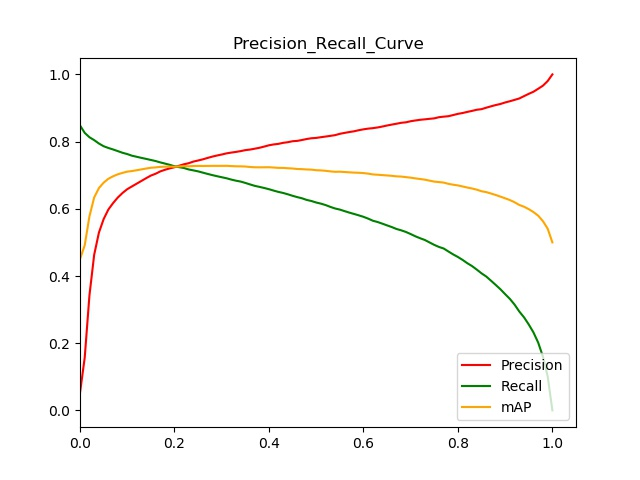
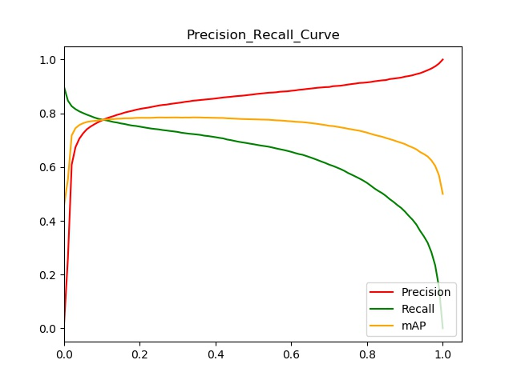
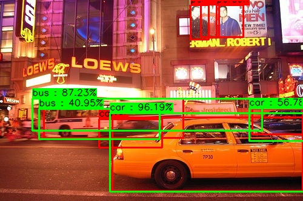
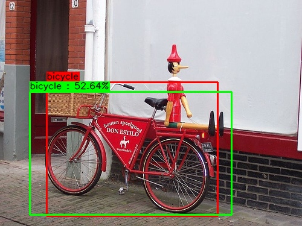
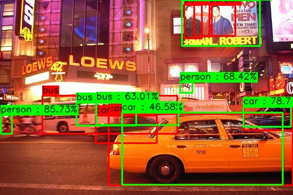
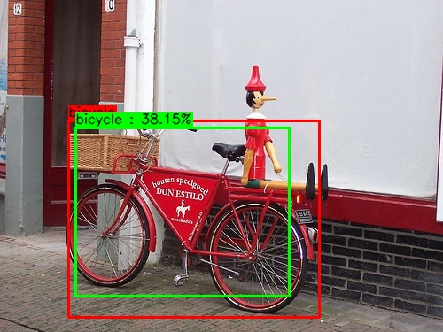
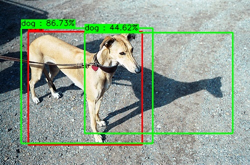

# Tensorflow_YOLOv1+

## Why YOLOv1+?
1. Fixed Loss to be simpler.
2. Applied the YOLOv2 concept.

## Results
### Pascal VOC 2007 Test
- (paper) YOLOv1-VGG16 : 66.4%
- (self) YOLOv1-VGG16 : 72.79%

- (self) YOLOv1-InceptionResNetv2 : 78.47%

## Samples
### YOLOv1-InceptionResNetv2

### YOLOv1-VGG16

## Requirements
- Tensorflow 1.13.1
- OpenCV 4.0.0
- Numpy 1.16.4

## Pretrained models 
- https://github.com/tensorflow/models/tree/master/research/slim