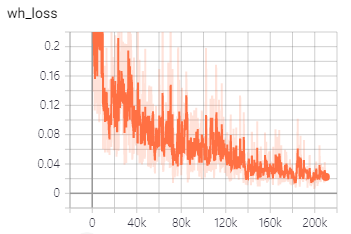
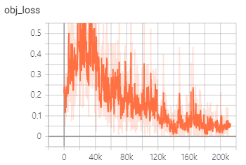
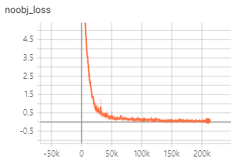
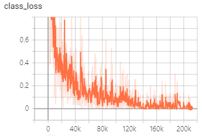
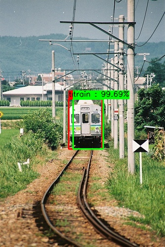
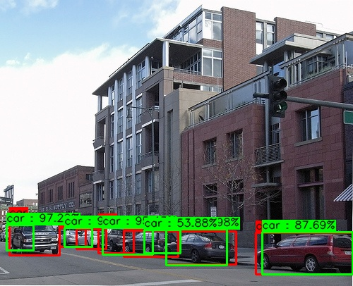
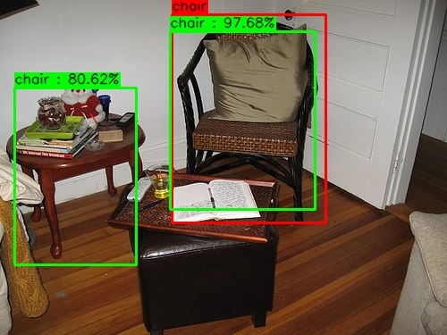

# You Only Look Once: Unified, Real-Time Object Detection

## # Summary
1. end-to-end
2. extremely fast (base YOLO : 45 FPS, Fast YOLO : 155 FPS, other SOTA 7~20 FPS)
3. YOLOv1-VGG16 mAP : 66.4% vs FasterRCNN mAP : 73.2% (Pascal VOC 2007 Test)
4. small objects do not detect well.
5. each grid cell only predicts two boxes and can only have one class.

## # Difference from Paper
1. GoogleNet -> ResNetv2-50, VGG16, Inception ResNet v2
2. Removed the responsible part.

## # Results (Pascal VOC 2007 Test AP@50)
| Class  | (self) YOLOv1-VGG16 | (self) YOLOv1-ResNetv2-50 |
| ------------- | ------------- | ------------- |
| aeroplane  | 75.23% | 68.38% |
| bicycle | 78.30% | 70.28% | 
| bird | 67.54% | 63.91% |
| boat | 55.93% | 49.64% | 
| bottle | 64.49% |  57.35% |
| bus | 78.75% |  81.63% |
| car | 77.83% |  71.31% |
| cat | 79.14% |  78.95% |
| chair | 63.65% |  56.38% |
| cow | 73.61% | 72.50% |
| diningtable | 68.76% | 66.00% |
| dog | 80.46% | 76.45% |
| horse | 79.26% |  70.27% |
| motorbike | 80.54% |  73.30% |
| person | 75.69% |  70.37% |
| pottedplant | 54.15% |  56.02% |
| sheep | 79.67% |  75.43% |
| sofa | 71.64% | 67.10% |
| train | 74.86% |  76.29% |
| tvmonitor | 76.21% | 73.99% |

| Model | Train | mAP@50 |
| ----- | ------ | ------ |
| (paper) Faster-RCNN VGG16 | Pascal VOC 2007 + 2012 | 73.2% |
| (paper) YOLOv1 VGG16 | Pascal VOC 2007 + 2012 | 66.4% |
| (self) YOLOv1 VGG16 | Pascal VOC 2007 + 2012| 72.78% |
| (self) YOLOv1 ResNet-v2-50 | Pascal VOC 2007 + 2012 | 68.78% |
| (self) YOLOv1 Inception-ResNet-v2 | Pascal VOC 2007 + 2012 | 69.05% |

## # Tensorboard
### 1. xy loss

### 2. wh loss

### 3. obj loss

### 4. noobj loss

### 5. class loss

## # Test Samples

## # Reference
- You Only Look Once: Unified, Real-Time Object Detection [[Paper]](https://pjreddie.com/media/files/papers/yolo_1.pdf)
- Faster R-CNN: Towards Real-Time Object Detection with Region Proposal Networks [[Paper]](https://arxiv.org/pdf/1506.01497.pdf)
